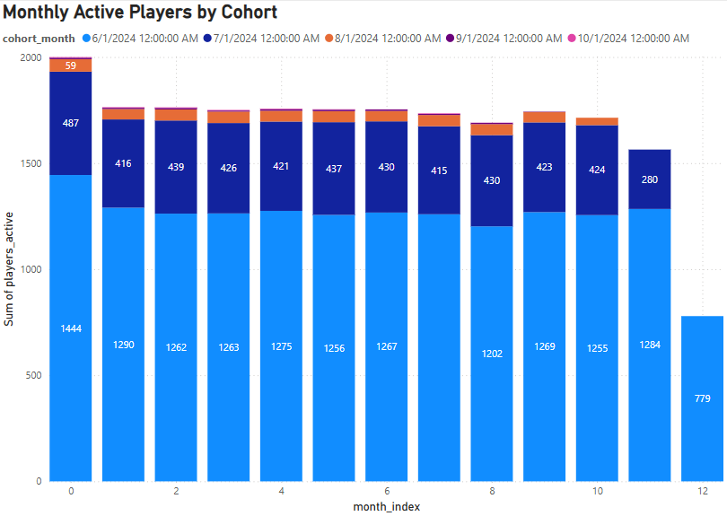

# 📊 SQL + Power BI Cohort Analysis

This project performs a cohort analysis on player activity using SQL and visualizes the results in Power BI.  
It shows how many players remain active each month after their first recorded activity.

---

## 🗂️ Project Structure

- `cohort_retention_query.sql` – SQL script that calculates:
  - Each player's first order month (cohort)
  - Player activity per month
  - Month index (0 = cohort month, 1 = next month, etc.)
- `cohort_retention.pbix` – Power BI dashboard file
- `README.md` – This documentation file

---

## 🔧 Tools Used

- PostgreSQL 
- Power BI (Matrix & Heatmap visuals)
- DBeaver query execution

---

## 📐 Cohort Logic

1. Find the first month each player made an order (cohort)
2. Count how many unique players made orders in subsequent months
3. Measure how many "returned" in month 1, 2, 3, etc.

Example result:

| cohort_month | month_index | players_active |
|--------------|-------------|----------------|
| 2024-01-01   | 0           | 120            |
| 2024-01-01   | 1           | 80             |
| 2024-01-01   | 2           | 55             |

---

## 📈 Power BI Dashboard Visuals

### 🔥 1. Cohort Retention Heatmap

Shows how many players remained active each month after joining.

---

### 📉 2. Retention Over Time

Line chart showing how retention drops as cohorts age.

---

### 📊 3. Monthly Active Players by Cohort

Grouped bar chart showing active players per month by cohort group.

---

## 🚀 How to Use

1. Connect Power BI directly to your PostgreSQL database
2. Run the cohort analysis SQL query inside Power BI’s query editor or DBeaver
3. Load the result as a table into Power BI
4. Build a matrix visual with:
   - **Rows**: `cohort_month`
   - **Columns**: `month_index`
   - **Values**: `players_active`

---

## 📜 License

MIT License — free to use and adapt.